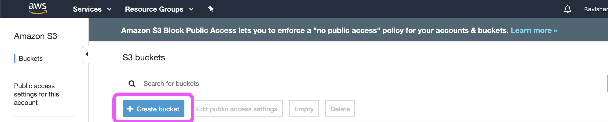
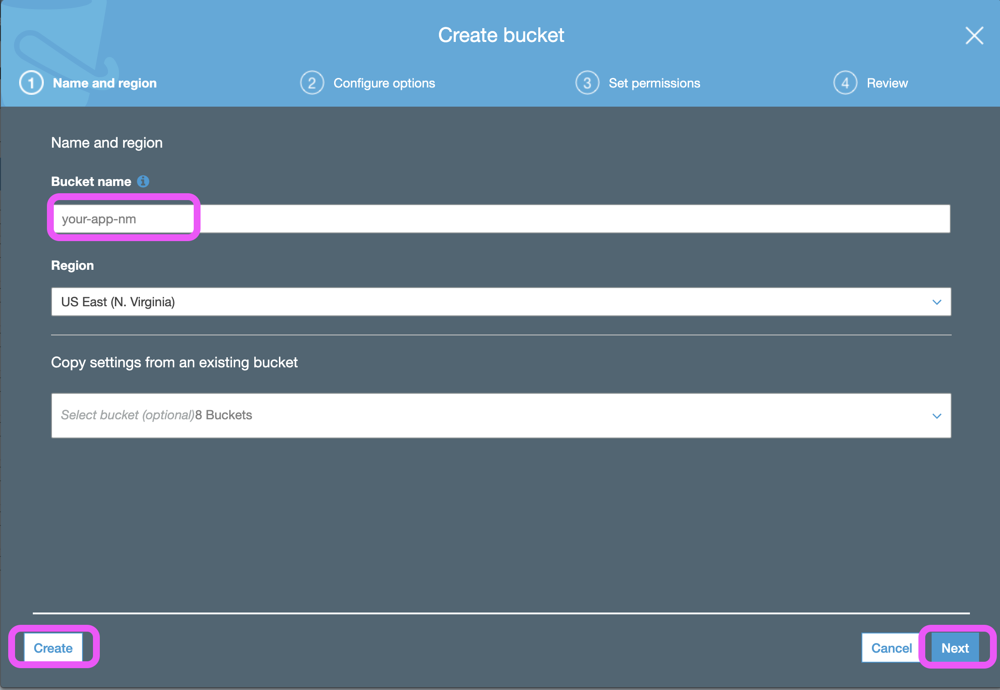
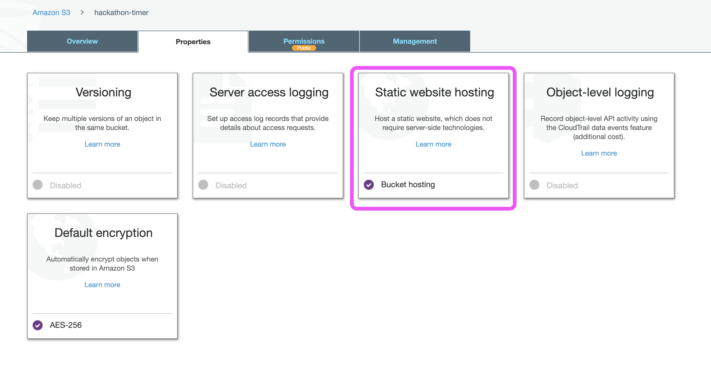
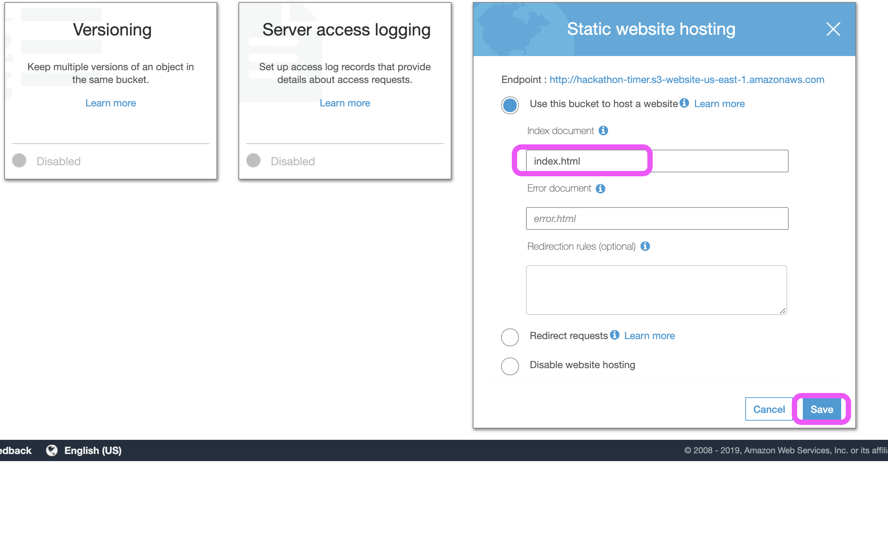
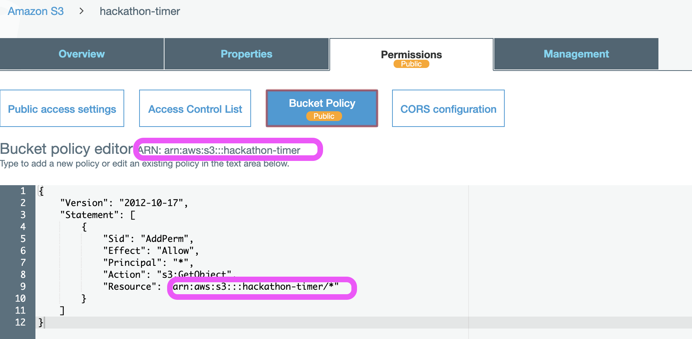
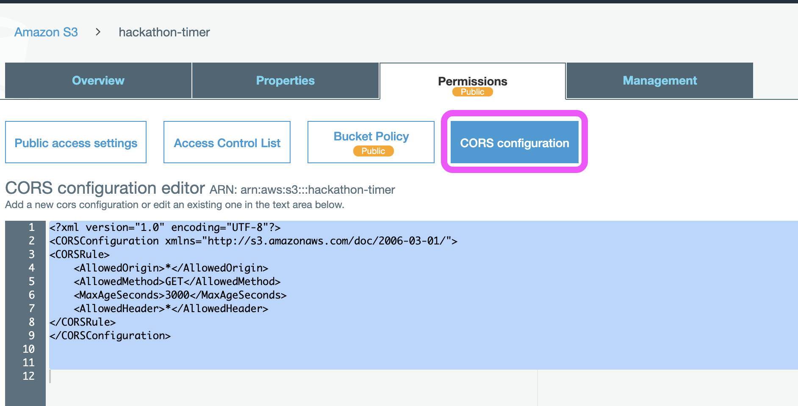

Hackathon Timer App
======================

Why?
------------
As we got ready to kick start the Reinvent the wheel Hackathon, the team prepared everything from the challenge, eye masks, catering, playlist, networking, live leaderboard, and the whole nine yards. However, when the time came to display a 24 Hr count down timer in the big screen, We couldn't find a decent, minimal, clutter-free Count down timer in the web without ads.

Here is a straightforward HTML/CSS/JS code to build a minimal Count Down Timer. The app is deployed in AWS S3 bucket, and it is as simple as creating a static hosting bucket and uploading the index.html. You could quickly change the logo, color scheme, fonts to match your need and taste.

Link to the App : http://hackathon-timer.s3-website-us-east-1.amazonaws.com/

### Setup Timer 

Update Line 77
```
var countDownDate = new Date("Mar 27, 2020 17:00:00").getTime();
```

### Clock Color
Update Line 54
```
.clock {
    transform: translateY(22vh);
    color: orangered;
    font-size: 4vh;
}
```

### Logo/Heading Text
Update Line 68
```
<clock>
    <div>
        <p class="logo">Reinvent The Wheel 2.0</p>
        <p class="clock" id="timer"></p>
    </div>
</clock>
```

### New Year 2020 Count Down Timer (Code Pen)

<p class="codepen" data-height="343" data-theme-id="dark" data-default-tab="html,result" data-user="ravishan16" data-slug-hash="KYdppM" data-preview="true" style="height: 343px; box-sizing: border-box; display: flex; align-items: center; justify-content: center; border: 2px solid black; margin: 1em 0; padding: 1em;" data-pen-title="New Year Count Down Timer">
  <span>See the Pen <a href="https://codepen.io/ravishan16/pen/KYdppM/">
  New Year Count Down Timer</a> by Ravishankar Sivasubramaniam (<a href="https://codepen.io/ravishan16">@ravishan16</a>)
  on <a href="https://codepen.io">CodePen</a>.</span>
</p>


### Deploy to AWS S3

1. Create an S3 Bucket (URL will be http://<Bucket-Name>.s3-website-<Region>.amazonaws.com/) and the bucket names should be globally unique

    

      
 
2. Set Properties 
    
    
      
 
3. Set Permission - Bucket Policy and CORS
   
   Bucket Policy
   ```
    {
        "Version": "2012-10-17",
        "Statement": [
            {
                "Sid": "AddPerm",
                "Effect": "Allow",
                "Principal": "*",
                "Action": "s3:GetObject",
                "Resource": "arn:aws:s3:::<Bucket Name>/*"
            }
        ]
    }
   ```
    

   CORS Configuration
   ```
    <?xml version="1.0" encoding="UTF-8"?>
    <CORSConfiguration xmlns="http://s3.amazonaws.com/doc/2006-03-01/">
    <CORSRule>
        <AllowedOrigin>*</AllowedOrigin>
        <AllowedMethod>GET</AllowedMethod>
        <MaxAgeSeconds>3000</MaxAgeSeconds>
        <AllowedHeader>*</AllowedHeader>
    </CORSRule>
    </CORSConfiguration>
   ```
  

4. Upload/Sync code to the bucker (Use awscli)
   ```
    aws s3 cp index.html s3://hackathon-timer/
   ```
<<<<<<< HEAD

License
-------

[MIT](https://github.com/atom/atom/blob/master/LICENSE.md)
=======
